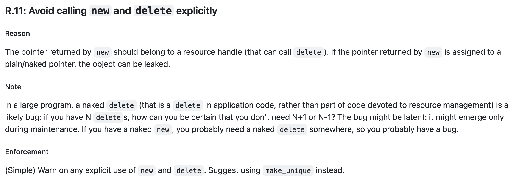
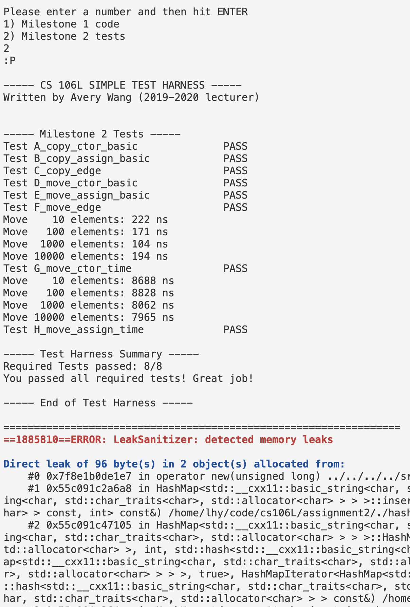
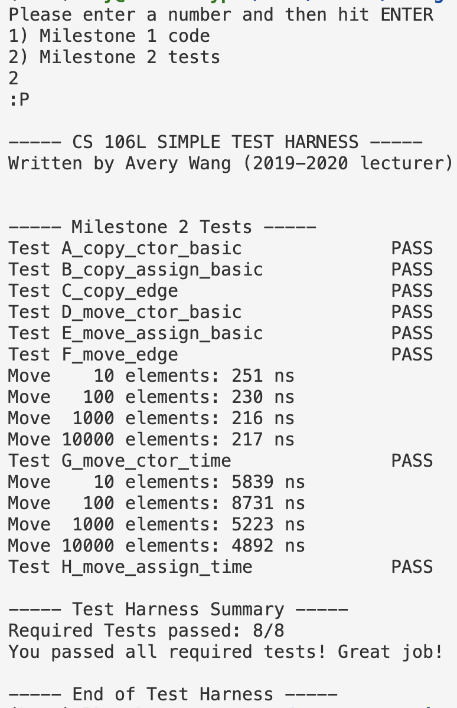

# 关于assignment2中的两个问题

## starter code是否是一个符合RAII的实践?

在Writeup中要求回答一个问题:

> This HashMap class is RAII-compliant. Explain why.

首先来说, **HashMap本身是RAII-compliant的**, 因为它提供了构造函数和析构函数,
并在构造函数中初始化了一些成员变量, 这些成员变量在析构函数中会被释放.
因此, 我们可以认为HashMap一个RAII-compliant的类.

但是**starter code所提供的HashMap的实现真的符合RAII的原则吗?** 个人感觉并不是.

先来看slides中instructor所给出的有关RAII的定义:

- All resources used by a class should be acquired in the constructor!

- All resources that are used by a class should be released in the destructor.

再来看[CppCoreGuidelines](https://github.com/isocpp/CppCoreGuidelines/blob/master/CppCoreGuidelines.md#r11-avoid-calling-new-and-delete-explicitly)
中有关内存管理的一条准则:

<div style="text-align:center">

</div>

简单来说, 这些定义和准则都在告诉我们一件事:

1. 采用RAII的实践: 不要显式地去管理内存, 如果需要对某个资源进行管理, 应该把它封装成一个类, 在构造函数中进行资源的初始化,
在析构函数中释放资源. 然后用户通过构造函数来获取资源, 由C++本身来管理资源的生命周期(通过析构函数).

2. 如果真的需要显式的去管理某个资源(因为有时候为每个资源都额外实现一个类会导致代码很冗长),
就应该使用智能指针, 进而避免在代码中裸露地使用`new`和`delete`, 这样做后同样能满足RAII的要求.

再看到`hashmap.cpp`中涉及到资源管理的两个成员函数: `clear`和`insert`

```cpp
template <typename K, typename M, typename H>
void HashMap<K, M, H>::clear() {
    for (auto& curr : _buckets_array) {
        while (curr != nullptr) {
            auto trash = curr;
            curr = curr->next;
            delete trash;
        }
    }
    _size = 0;
}

template <typename K, typename M, typename H>
std::pair<typename HashMap<K, M, H>::iterator, bool> HashMap<K, M, H>::insert(const value_type& value) {
    const auto& [key, mapped] = value;
    auto [prev, node_to_edit] = find_node(key);
    size_t index = _hash_function(key) % bucket_count();

    if (node_to_edit != nullptr) {
        return {make_iterator(node_to_edit), false};
    }

    auto temp = new node(value, _buckets_array[index]);
    _buckets_array[index] = temp;

    ++_size;
    return {make_iterator(temp), true};
}
```

可以看到, 在`insert`中申请`node`资源时并没有使用智能指针, 而是"裸露地"使用`new`,
同时这也造成了必须在`clear`函数显式地`delete`每个`bucket`中的`node`("裸露地"使用`delete`),
**这些做法显然违背了RAII的要求**.

事实上如果在build代码时加入sanitizer, 会发现测试代码在运行时**居然会发生内存泄露**:

<div>
    
</div>

解决方法也很简单, **在定义node struct时采用智能指针**, 并**删掉clear中的delete操作**即可,
在我提供的[solution](../../solutions)中就是这么做的. 最后内存泄漏的问题也就消失了.

<div>

</div>

可以说instructor通过亲身实践告诉了我们RAII实践的重要性.

> 事实上在2023的starter code中, clear函数的循环中只有`curr = curr->next;`这行代码, 但令人困惑的是node struct的定义仍然没有使用智能指针, 这是明显违背常理的. 个人感觉这个点很奇怪.

## 有关HashMap中移动赋值运算符的实现

这是我给出的实现:

```cpp
template<typename K, typename M, typename H>
HashMap<K, M, H>& HashMap<K, M, H>::operator=(HashMap<K, M, H>&& other) {
    if (this != &other) {
        clear();
        _size = std::move(other._size);
        _hash_function = std::move(other._hash_function);
        _buckets_array = std::move(other._buckets_array);
    }
    return *this;
}
```

其中`_buckets_array = std::move(other._buckets_array)`直接利用了`std::vector`提供的移动语义,
但是这段代码其实无法通过测试, 并且问题就是出现在这行代码上.

再来看看测试代码出问题的地方:

```cpp
{
    /* 3. Expanded self-assignment */
    // suppress the really annoying warnings
    #pragma GCC diagnostic push
    // #pragma GCC diagnostic ignored "-Wself-move"
    HashMap<std::string, int> map1;
    HashMap<std::string, int> map2;
    map1.insert({"A", 1});
    map1.insert({"B", 2});
    map2.insert({"C", 3});
    std::unordered_map<std::string, int> answer1 {{"A", 1}, {"B", 2}};
    std::unordered_map<std::string, int> answer2 {{"C", 3}};

    map1 = std::move(map2) = std::move(map2) = std::move(map1);
    answer1 = std::move(answer2) = std::move(answer2) = std::move(answer1);
    VERIFY_TRUE(check_map_equal(map1, answer1), __LINE__);
    VERIFY_TRUE(check_map_equal(map2, answer2), __LINE__);

    (map1 = std::move(map1)) = std::move(std::move(map1) = (std::move(map1) = map1 = std::move(map1)));
    VERIFY_TRUE(check_map_equal(map1, answer1), __LINE__);
    VERIFY_TRUE(check_map_equal(map2, answer2), __LINE__);
    #pragma GCC diagnostic pop
    // your code could crash at this line due to memory problems!

    // Check that the map is still assignable from.
    HashMap<std::string, int> copy = map1;
    HashMap<std::string, int> temp, new_assign;
    temp = std::move(map1);
    new_assign = std::move(temp);
    VERIFY_TRUE(check_map_equal(new_assign, temp), __LINE__);
}
```

这里以`map1 = std::move(map2) = std::move(map2) = std::move(map1);`为例, 解释一下为什么代码会在这里出问题.

首先, 这行代码其实等价于:

```cpp
std::move(map2) = std::move(map1);
std::move(map2) = std::move(map2);
map1 = map2;
```

前两行没问题, 问题出在第三行: `map1 = map2;`触发了HashMap的赋值运算符, 这个赋值运算符的实现用到了`insert`成员函数,
而在`insert`中有这么一行代码`size_t index = _hash_function(key) % bucket_count();`,
然后问题就出现了: `bucket_count`返回的是HashMap中`std::vector`的大小, 但是在此之前`map1`已经作为右值赋值给了`map2`,
而`map2`的移动赋值运算符中使用了`std::vector`的移动语义, 这导致了在把`map1`的`std::vector`移交给`map2`后,
`map1`的`std::vector`会被置空(防止重新使用右值资源), 从而`bucket_count`返回0, 造成了取模运算的错误.

其实简单来说就是, 测试代码使用了`std::move`后的右值, 然后又向这个右值获取资源,
从而**造成了未定义行为**(因为如何对右值的资源进行管理是未定义的), 只不过`std::unordered_map`正确地处理了这种未定义行为.
但不管怎么说, **重新向右值索取资源本身就应该是不被允许的**, 所以我个人对这段测试代码持保留态度,

> 事实上这段测试代码从注释上来看应该是想测试移动赋值运算符是否正确处理了self-assignment和链式赋值,
> 而不是要求处理重新向右值获取资源这样的未定义行为.

解决办法也很简单: 在测试代码中增添一些代码, 用于在获取右值的资源之前重新给右值赋予资源即可.
> 修改后的测试同样放在[solution](../../solutions)目录里了.

这里我还想解释一下网上的一种很常见的实现方式, 这个实现能通过原始的测试代码:

```cpp
template <typename K, typename M, typename H>
 HashMap<K,M,H>& HashMap<K,M,H>::operator=(HashMap<K,M,H>&& other)
 {
    if(&other==this) {
        clear();
        _size = std::move(other._size);
        _hash_function = std::move(other._hash_function);

        _buckets_array.resize(other.bucket_count());
        for (size_t i = 0; i < other.bucket_count(); i++) {
            _buckets_array[i] = std::move(other._buckets_array[i]);
            other._buckets_array[i] = nullptr;
        }
        return *this;
    }
 }
```

原因也很简单, 因为它在处理`other`的`_buckets_array`时, 并不像`std::vector`那样清空右值的资源,
而是保留了`vector`的大小, 只不过是把指针置空了, 也正是如此才能使它恰好可以处理未定义行为(`bucket_count`不会返回0).
